# An Infinite Canvas Tutorial

[](https://github.com/xiaoiver/infinite-canvas-tutorial/blob/master/LICENSE)
[](https://docs.excalidraw.com/docs/introduction/contributing)
[](https://github.com/xiaoiver/infinite-canvas-tutorial/actions/workflows/unit-ssr.yml)
[](https://coveralls.io/github/xiaoiver/infinite-canvas-tutorial?branch=master)

> [My free course in Gumroad]. Feel free to rate!

[](https://ko-fi.com/U7U71DK7IM)

[](https://stackblitz.com/edit/vite-tvhpcpvl?file=main.js)

What is an Infinite Canvas? The term "infinite" in [infinitecanvas] is described as follows:

-   High scalability. Users can freely organize content structures in a non-linear fashion.
-   Zooming. Emulates the "zoom in" to get an overview and "zoom out" to observe details as in the real world.
-   Direct manipulation. Provides intuitive editing capabilities for basic shapes, including moving, grouping, and modifying styles.

The [infinitecanvas] showcases numerous examples ranging from design tools to creative boards, including some well-known products such as: [Figma], [Modyfi], [Motiff], [rnote], [tldraw], [excalidraw] and so on.

As a front-end developer, I am very interested in the rendering technologies involved. Although tldraw, excalidraw, and others generally use more user-friendly technologies like Canvas2D/SVG, there are also many editors and design tools in the JS and Rust ecosystems that use more low-level rendering technologies for 2D graphics with GPU acceleration to achieve better performance and experience:

-   [Figma] uses a tile-based rendering engine written in C++, compiled into WASM and then calls WebGL for rendering.
-   [Motiff] also uses a tile-based rendering engine with WebGL.
-   [Modyfi] uses [wgpu] from the Rust ecosystem, also compiled into WASM and then calls WebGL2 for rendering.
-   [Zed] uses GPUI to render rectangles, shadows, text, images, and other UI elements.
-   [Vello] and [xilem] experimentally use Compute Shader for 2D rendering.

Therefore, in this tutorial, I hope to implement the following features:

-   Use [@antv/g-device-api] as a hardware abstraction layer, supporting WebGL1/2 and WebGPU.
-   Use [Becsy] to implement high-performance, highly scalable systems based on the ECS architecture.
-   Use SDF (Signed Distance Field) rendering for circles, ellipses, rectangles, etc.
-   GPU-accelerated text and Bezier curve rendering.
-   Use [rough.js] to support hand-drawn styles.
-   Use CRDT (Conflict-free Replicated Data Type) to support collaborative [Yjs].
-   Referencing [mapbox] and [Figma], attempt to use tile-based rendering.

I hope to rewrite the rendering part of the canvas with Rust in the future, but the current project completion is still relatively low:

-   [wgpu] is a very reliable hardware abstraction layer, which can even implement the backend for [piet].
-   Shaders can basically be reused.
-   Hand-drawn styles can use [rough-rs].
-   [y-crdt] is the Rust implementation of [Yjs].

Let's get started!

## Getting Started

The course project uses pnpm workspace, so you need to install pnpm first.

```bash
pnpm i
```

After entering the course directory, run Vite devserver:

```bash
cd packages/lesson_001
pnpm run dev
```

Or you can run the site locally:

```bash
pnpm run build
cd packages/site
pnpm run dev
```

If you want to use it in your own project, you can refer to:

-   [@infinite-canvas-tutorial/ecs]
-   [@infinite-canvas-tutorial/webcomponents]

## Lesson 1 - Initialize canvas [🔗](https://infinitecanvas.cc/guide/lesson-001)

-   A hardware abstraction layer based on WebGL1/2 and WebGPU.
-   Canvas API design.
-   Implementing a simple plugin system.
-   Implementing a rendering plugin based on the hardware abstraction layer.

## Lesson 2 - Draw a circle [🔗](https://infinitecanvas.cc/guide/lesson-002)

-   Adding shapes to the canvas.
-   Drawing a circle using SDF.
-   Anti Aliasing.
-   Dirty flag design pattern.

## Lesson 3 - Scene graph and transform [🔗](https://infinitecanvas.cc/guide/lesson-003)

-   Transformations. Make shapes support pan, zoom, rotate, and skew transformations.
-   Scene graph.

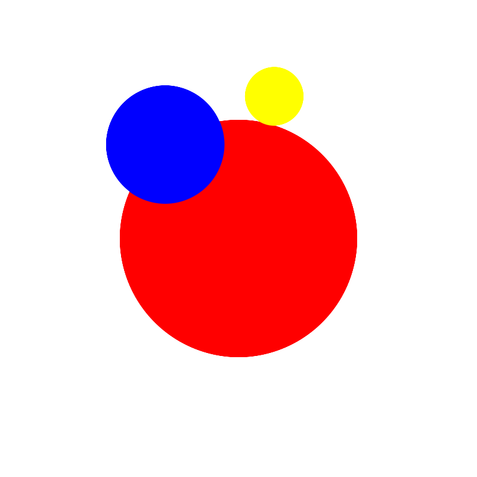

## Lesson 4 - Camera [🔗](https://infinitecanvas.cc/guide/lesson-004)

-   What is a Camera?
-   Projection transformation.
-   Camera transformation.
-   Camera animation. Using Landmark transition between different camera states.

## Lesson 5 - Grid [🔗](https://infinitecanvas.cc/guide/lesson-005)

-   Drawing straight lines using Line Geometry or screen-space techniques.
-   Drawing dots grid.
-   Drawing wireframe for Geometry.

|                Grid                |                 Wireframe                 |
| :--------------------------------: | :---------------------------------------: |
| 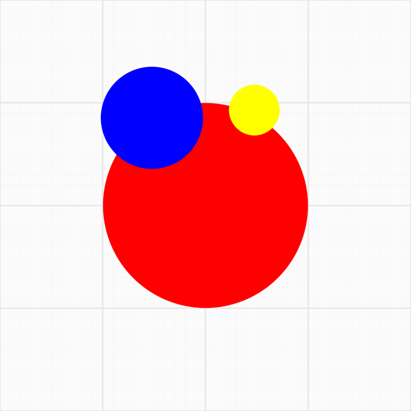 | 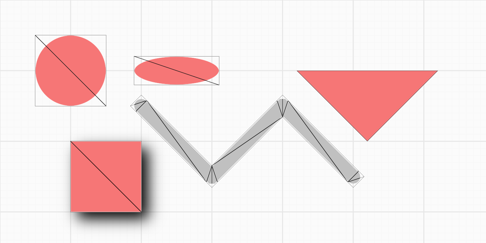 |

## Lesson 6 - Event system [🔗](https://infinitecanvas.cc/guide/lesson-006)

-   Implement an event system compatible with DOM Event API.
-   How to pick a circle.
-   Implement a drag-and-drop plugin based on our event system.
-   Support for pinch zoom gestures.

## Lesson 7 - Web UI [🔗](https://infinitecanvas.cc/guide/lesson-007)

-   Developing Web UI with Lit and Shoelace
-   Implementing a canvas component
-   Implementing a zoom toolbar component
-   Implementing a dark theme

## Lesson 8 - Optimize performance [🔗](https://infinitecanvas.cc/guide/lesson-008)

-   What is a draw call
-   Reducing draw calls with culling
-   Reducing draw calls by combining batches
-   Using spatial indexing to improve pickup efficiency

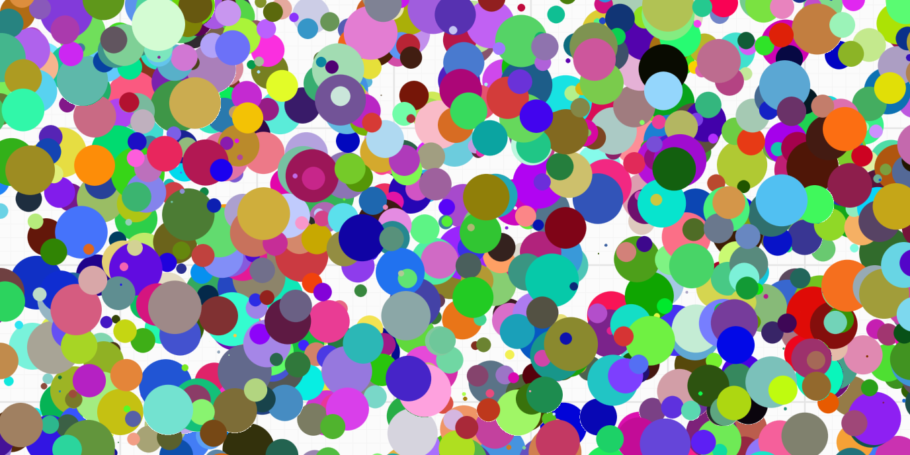

## Lesson 9 - Draw ellipse and rectangle [🔗](https://infinitecanvas.cc/guide/lesson-009)

-   How to derive the SDF representation of an ellipse or rounded rectangle
-   Render drop-shadow and inner shadow for SDF
-   How to determine if a point is inside an ellipse or rounded rectangle

|                Drop Shadow                |                 Inner Shadow                 |
| :---------------------------------------: | :------------------------------------------: |
| 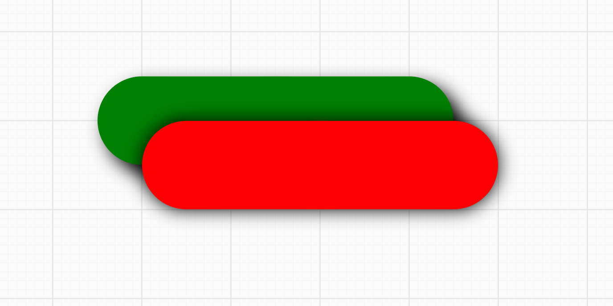 | 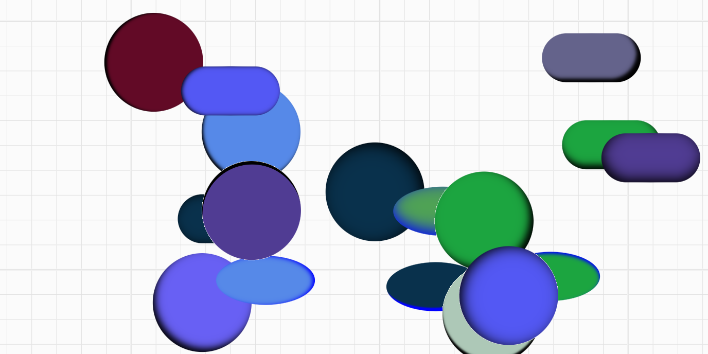 |

## Lesson 10 - Import and export images [🔗](https://infinitecanvas.cc/guide/lesson-010)

-   Exporting canvas content to PNG, JPEG and SVG formats
-   Rendering images in the canvas
-   Extending the capabilities of SVG, using `stroke-alignment` as an example

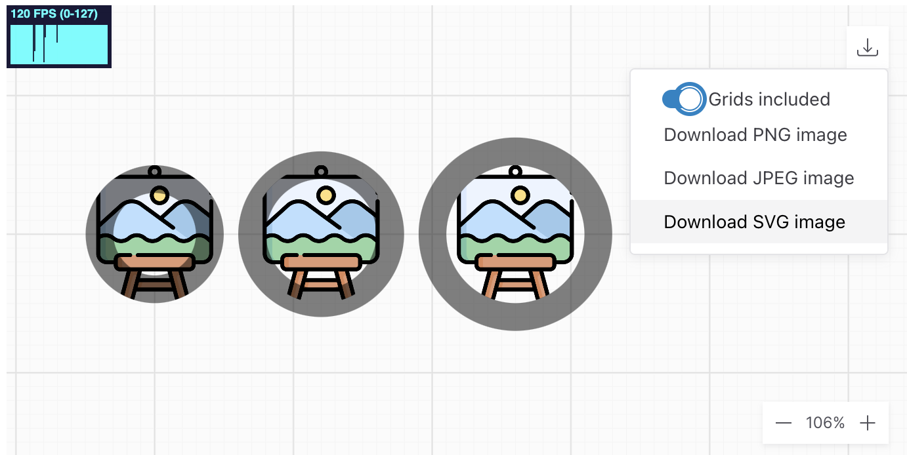

## Lesson 11 - Test and server-side rendering [🔗](https://infinitecanvas.cc/guide/lesson-011)

-   Jest-based test environment setup, including local and CI environments
-   Using unit tests to improve code coverage
-   Visual regression testing
    -   Server-side rendering based on headless-gl, targets WebGL1
    -   E2E testing base on Playwright, targets WebGL2 & WebGPU
-   E2E UI testing
-   Browser Compatibility Test based on BrowserStack
-   Render in WebWorker

## Lesson 12 - Draw polyline [🔗](https://infinitecanvas.cc/guide/lesson-012)

-   Why not just use `gl.LINES`?
-   Building Mesh in the CPU or Shader
-   Building segments, caps and joints, antialiasing, and drawing dashed lines in shader
-   How to calculate its bounding box?

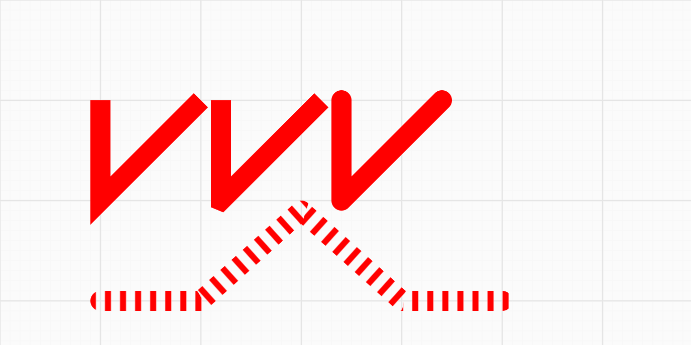

## Lesson 13 - Draw path and hand-drawn shapes [🔗](https://infinitecanvas.cc/guide/lesson-013)

-   Experimenting with SDF
-   Trying to draw fills using some triangulating methods and strokes using polylines
    -   Support earcut and libtess.js two triangulation schemes
    -   Handle holes in the path correctly
    -   Support `fillRule` property
-   Draw some hand-drawn shapes

|                Path and rough shapes                 |                 Fill rule                  |
| :--------------------------------------------------: | :----------------------------------------: |
| 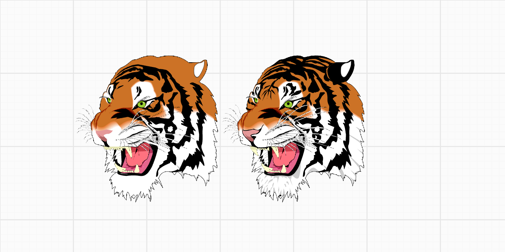 | 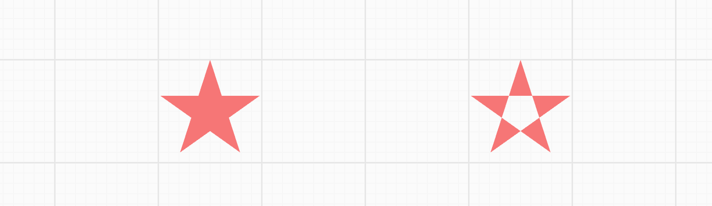 |

## Lesson 14 - Canvas mode and auxiliary UI [🔗](https://infinitecanvas.cc/guide/lesson-014)

-   Implement `zIndex` and `sizeAttenuation`
-   Add more canvas modes, e.g. move and select and shapes

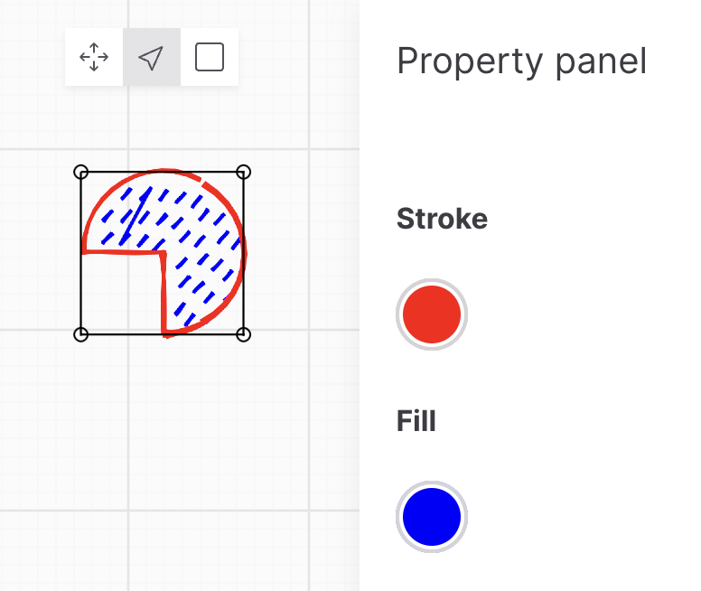

## Lesson 15 - Draw text [🔗](https://infinitecanvas.cc/guide/lesson-015)

-   What's TextMetrics and how to get it in server and browser side
-   What's shaping? Implement letterSpacing and kerning
-   Paragraph layout
    -   Auto wordbreak
    -   BiDi, arabic shaping included
    -   Handle clusters
    -   Support text-align
-   How to generate SDF atlas and use it to draw
-   How to use ESDT and MSDF to improve text rendering quality
-   How to draw bitmap font
-   How to draw emoji

|                  Render text with SDF atlas                   |     Bitmap font, emoji, BiDi and clusters      |
| :-----------------------------------------------------------: | :--------------------------------------------: |
| 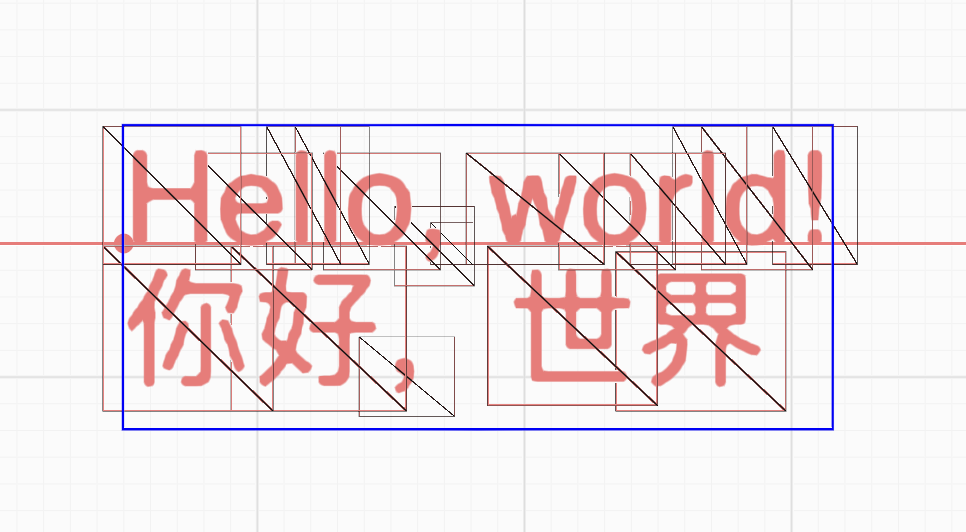 | 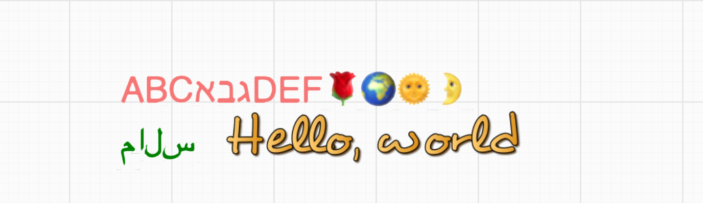 |

## Lesson 16 - Advanced text features [🔗](https://infinitecanvas.cc/guide/lesson-016)

-   Using Bezier curves to render text, shaping with OpenType and Harfbuzz
-   Render TeX math
-   Text stroke, decoration, dropshadow and text along path
-   Physical text rendering
-   Load web font with web font loader

|                Shaping TeX with MathJax                 |                 Physical text                  |
| :-----------------------------------------------------: | :--------------------------------------------: |
| 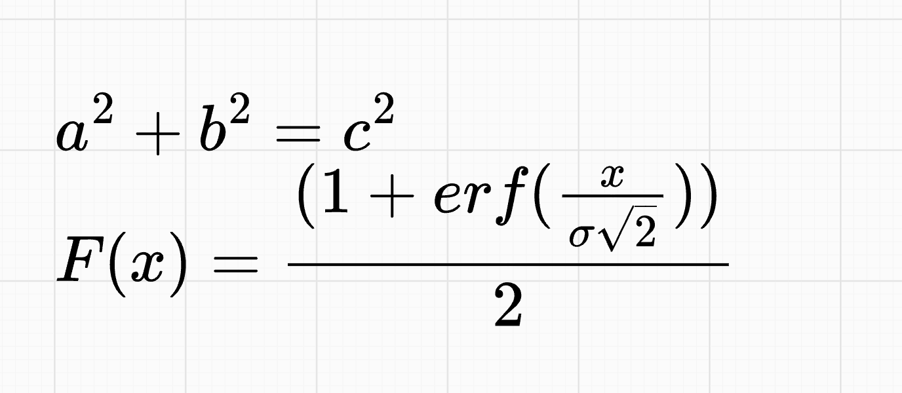 |  |

|                     Text decoration                     |                 Text stroke                  |
| :-----------------------------------------------------: | :------------------------------------------: |
| 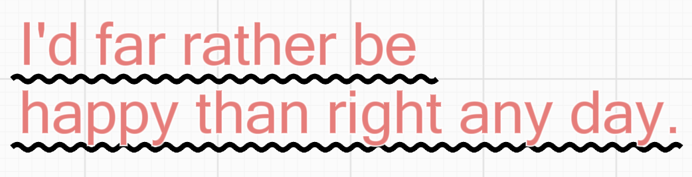 | 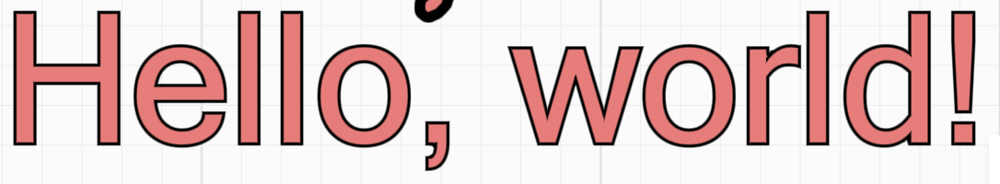 |

## Lesson 17 - Gradient and Pattern [🔗](https://infinitecanvas.cc/guide/lesson-017)

-   Use CanvasGradient to implement gradients
    -   Imperative. Create textures using the Device API
    -   Declarative. Supports CSS gradient syntax: `linear-gradient`, `radial-gradient`, `conic-gradient`
    -   Use Shoelace to implement gradient configuration panel
-   Use Shader to implement Mesh Gradient
    -   Simulate random
    -   Value Noise and Gradient Noise
    -   Voronoi, FBM and Domain Warping
-   Export SVG
-   Use CanvasPattern to implement repeating patterns

|                Linear, Radial, Conic Gradient                 |                 Mesh Gradient                  |
| :-----------------------------------------------------------: | :--------------------------------------------: |
|  |  |


## Lesson 18 - Refactor with ECS [🔗](https://infinitecanvas.cc/guide/lesson-018)

-   What is ECS architecture
-   Using ECS architecture to refactor the application with [Becsy]
-   Using [Spectrum] to implement UIs instead of shoelace

|                Top nav and zoom toolbar                 |                 Layers and properties panels                  |
| :-----------------------------------------------------: | :-----------------------------------------------------------: |
| 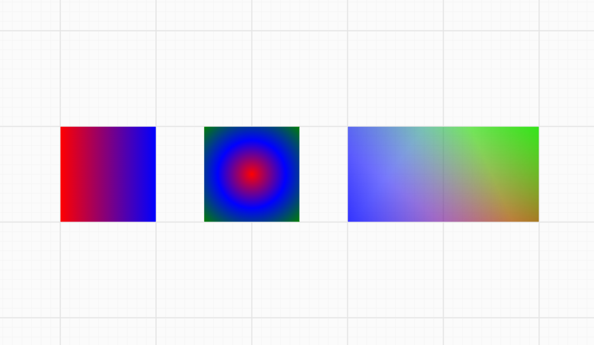 | 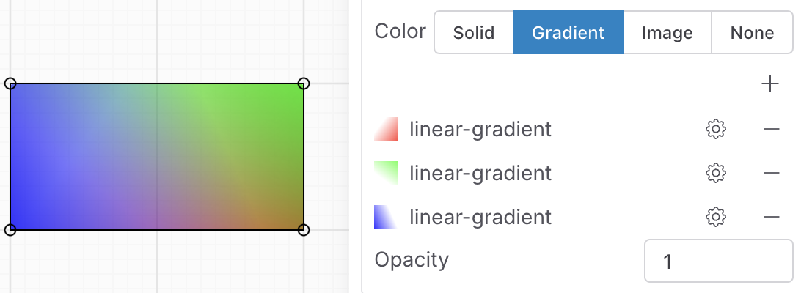 |

## Lesson 19 - History [🔗](https://infinitecanvas.cc/guide/lesson-019)

-   Implement a simple history system, including undo and redo

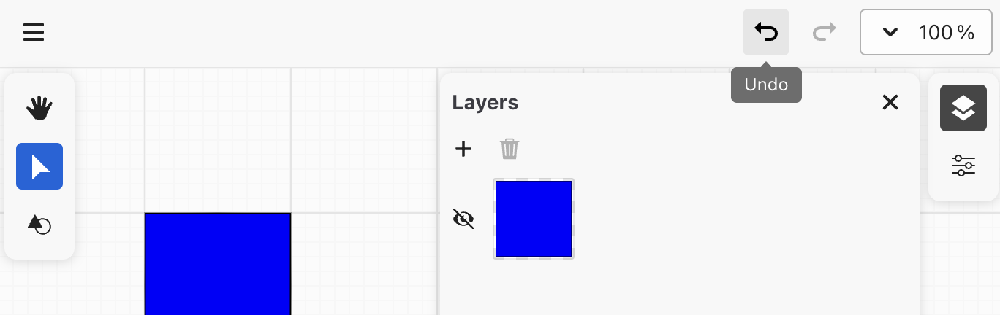

## Lesson 20 - Collaboration [🔗](https://infinitecanvas.cc/guide/lesson-020)

-   Implement collaboration through CRDT

## Lesson 21 - Transformer [🔗](https://infinitecanvas.cc/guide/lesson-021)

-   Resize, lock aspect ratio and centered scaling
-   Rotate and change the rotation origin
-   Nudge shapes with arrow key

|                Rotate anchor                 |                 Resize anchor                  |
| :------------------------------------------: | :--------------------------------------------: |
| 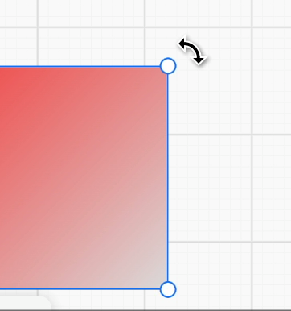 | 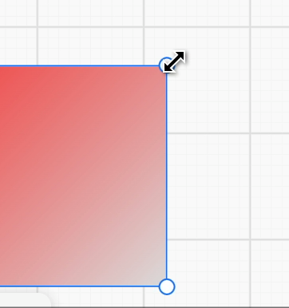 |

## Lesson 22 - VectorNetwork [🔗](https://infinitecanvas.cc/guide/lesson-022)

-   Limitations of SVG Path
-   What is VectorNetwork

## Lesson 23 - Mindmap [🔗](https://infinitecanvas.cc/guide/lesson-023)

-   Analyze d3-tree, d3-flextree and @antv/hierarchy

|                 D3 flextree                  |                Mindmap                 |
| :------------------------------------------: | :------------------------------------: |
| 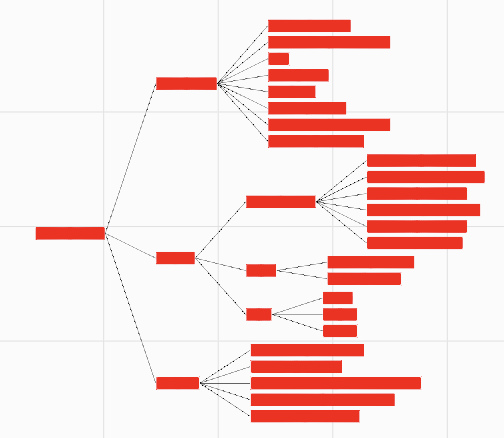 | 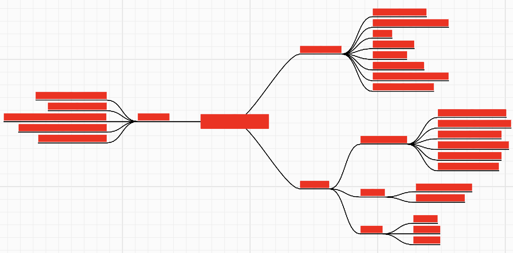 |

## Lesson 24 - Context menu and clipboard [🔗](https://infinitecanvas.cc/guide/lesson-024)

-   How to implement context menu with Spectrum
-   Adjust z-index with bring forward and send back
-   Writes and reads clipboard content, supports pasting serialized graphics, non-vector images, SVG and plain text
-   Drag-and-drop import of image files from file systems and pages

|                Context menu                 |               Drag'n'drop image                |
| :-----------------------------------------: | :--------------------------------------------: |
|  | 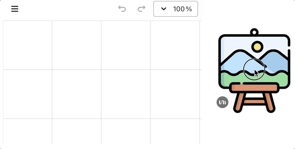 |

[infinitecanvas]: https://infinitecanvas.tools/
[Figma]: https://madebyevan.com/figma/building-a-professional-design-tool-on-the-web/
[Modyfi]: https://digest.browsertech.com/archive/browsertech-digest-how-modyfi-is-building-with/
[rnote]: https://github.com/flxzt/rnote
[tldraw]: https://github.com/tldraw/tldraw
[excalidraw]: https://github.com/excalidraw/excalidraw
[rough.js]: https://github.com/rough-stuff/rough
[rough-rs]: https://github.com/orhanbalci/rough-rs
[zed]: https://zed.dev/blog/videogame
[wgpu]: https://wgpu.rs/
[vello]: https://github.com/linebender/vello
[xilem]: https://github.com/linebender/xilem
[piet]: https://github.com/linebender/piet
[@antv/g-device-api]: https://github.com/antvis/g-device-api
[mapbox]: https://blog.mapbox.com/rendering-big-geodata-on-the-fly-with-geojson-vt-4e4d2a5dd1f2?gi=e5acafcf219d
[Yjs]: https://yjs.dev/
[y-crdt]: https://github.com/y-crdt/y-crdt
[Motiff]: https://www.motiff.com/blog/performance-magic-behind-motiff
[My free course in Gumroad]: https://pyqiverson.gumroad.com/l/infinitecanvas?a=734684947
[Becsy]: https://lastolivegames.github.io/becsy/
[Spectrum]: https://opensource.adobe.com/spectrum-web-components
[@infinite-canvas-tutorial/ecs]: https://www.npmjs.com/package/@infinite-canvas-tutorial/ecs
[@infinite-canvas-tutorial/webcomponents]: https://www.npmjs.com/package/@infinite-canvas-tutorial/webcomponents
