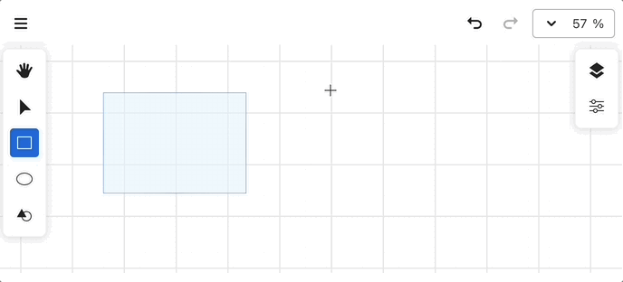
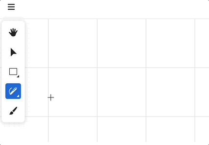
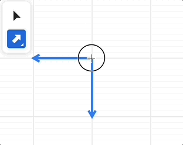

# 一个无限画布教程

[](https://github.com/xiaoiver/infinite-canvas-tutorial/blob/master/LICENSE)
[](https://docs.excalidraw.com/docs/introduction/contributing)
[](https://github.com/xiaoiver/infinite-canvas-tutorial/actions/workflows/unit-ssr.yml)
[](https://coveralls.io/github/xiaoiver/infinite-canvas-tutorial?branch=master)

> [我在 Gumroad 上的免费课程]，欢迎评分！

[](https://ko-fi.com/U7U71DK7IM)

[](https://stackblitz.com/edit/vite-tvhpcpvl?file=main.js)

什么是无限画布？[infinitecanvas] 对“无限”的描述如下：

-   高扩展性。用户可以以非线形的形式自由组织内容结构。
-   缩放。模拟真实世界中的“放大”纵览全局和“缩小”观察细节。
-   直接操作。提供对于基础图形的直观编辑能力，包括移动、成组、修改样式等。
-   实时协作。

你一定见过甚至使用过各种包含无限画布的应用，[infinitecanvas] 上就展示了从设计工具到创意画板在内的众多案例，其中不乏一些知名产品包括 [Figma]、[Modyfi]、[Motiff]、[rnote]、[tldraw]、[excalidraw]等等。

作为一个前端，我对其中涉及到的渲染技术很感兴趣。尽管 [tldraw]、[excalidraw] 等普遍使用易用性更高的 Canvas2D / SVG 技术，但 JS 和 Rust 生态中也有很多编辑器、设计工具使用更底层的渲染技术对 2D 图形进行 GPU 加速，以获得更好的性能和体验：

-   [Figma] 使用 C++ 编写了一个 tile-based 的渲染引擎，编译成 WASM 后调用 WebGL 渲染
-   [Motiff] 同样使用 WebGL 实现了一个 tile-based 渲染引擎
-   [Modyfi] 使用了 Rust 生态中的 [wgpu]，同样编译成 WASM 后调用 WebGL2 渲染
-   [Zed] 使用 GPUI 渲染矩形、阴影、文本、图片等 UI。
-   [vello] 和 [xilem] 实验性地使用了 Compute Shader 进行 2D 渲染。

因此在这个教程中，我希望实现以下特性：

-   使用 [@antv/g-device-api] 作为硬件抽象层，支持 WebGL1/2 和 WebGPU
-   使用 [Becsy] 实现基于 ECS 架构的高性能、高可扩展性系统
-   使用 SDF 渲染圆、椭圆、矩形等基础图形
-   实现 GPU 加速的文本和贝塞尔曲线渲染
-   使用 [rough.js] 支持手绘风格
-   使用 CRDT 支持协同 [Yjs]
-   参考 [mapbox] 和 [Figma]，尝试使用 Tile-based 渲染

未来我希望将画布的渲染部分用 Rust 重写，目前项目的完成度还比较低：

-   [wgpu] 是非常可靠的硬件抽象层，甚至可以为 [piet] 实现后端。
-   Shader 基本可以复用。
-   手绘风格可以使用 [rough-rs]。
-   [y-crdt] 是 [Yjs] 的 Rust 实现。

让我们开始吧！

## 开始

课程项目使用了 [pnpm workspace]，因此需要先安装 [pnpm]

```bash
pnpm i
```

进入课程目录后，启动 Vite 开发服务器

```bash
cd packages/lesson_001
pnpm run dev
```

或者你也可以本地运行这个教程站点

```bash
pnpm run build
cd packages/site
pnpm run dev
```

如果想在自己的项目中使用，可以参考：

-   [@infinite-canvas-tutorial/ecs]
-   [@infinite-canvas-tutorial/webcomponents]

## 课程 1 - 初始化画布 [🔗](https://infinitecanvas.cc/zh/guide/lesson-001)

-   基于 WebGL1/2 和 WebGPU 的硬件抽象层
-   画布 API 设计
-   实现一个简单的插件系统
-   基于硬件抽象层实现一个渲染插件

## 课程 2 - 绘制圆 [🔗](https://infinitecanvas.cc/zh/guide/lesson-002)

-   向画布中添加图形
-   使用 SDF 绘制一个圆形
-   反走样

## 课程 3 - 变换和场景图 [🔗](https://infinitecanvas.cc/zh/guide/lesson-003)

-   变换。让图形支持平移、缩放、旋转、斜切变换
-   实现场景图


## 课程 4 - 相机 [🔗](https://infinitecanvas.cc/zh/guide/lesson-004)

-   相机是什么
-   投影变换
-   相机变换。通过一个插件实现平移、旋转和缩放功能
-   相机动画。平滑过渡到任意相机状态

## 课程 5 - 绘制网格 [🔗](https://infinitecanvas.cc/zh/guide/lesson-005)

-   绘制直线网格。使用 Line Geometry 或者屏幕空间技术
-   绘制点网格
-   为 Geometry 绘制 wireframe

|                Grid                |                 Wireframe                 |
| :--------------------------------: | :---------------------------------------: |
|  |  |

## 课程 6 - 事件系统 [🔗](https://infinitecanvas.cc/zh/guide/lesson-006)

-   参考 DOM API 实现事件系统
-   如何拾取一个圆形
-   实现一个拖拽插件
-   支持双指缩放手势

## 课程 7 - Web UI [🔗](https://infinitecanvas.cc/zh/guide/lesson-007)

-   使用 Lit 和 Shoelace 开发 Web UI
-   实现画布组件，监听页面宽高变换
-   实现缩放组件
-   实现明暗主题

## 课程 8 - 性能优化 [🔗](https://infinitecanvas.cc/zh/guide/lesson-008)

-   什么是 Draw call
-   使用剔除减少 draw call
-   使用合批减少 draw call
-   使用空间索引提升拾取效率


## 课程 9 - 绘制椭圆和矩形 [🔗](https://infinitecanvas.cc/zh/guide/lesson-009)

-   推导椭圆和圆角矩形的 SDF 表示
-   为 SDF 增加外阴影和内阴影
-   如何判定任意点是否在椭圆或圆角矩形内

|                Drop Shadow                |                 Inner Shadow                 |
| :---------------------------------------: | :------------------------------------------: |
|  |  |

## 课程 10 - 图片导入和导出 [🔗](https://infinitecanvas.cc/zh/guide/lesson-010)

-   将画布内容导出成 PNG，JPEG 和 SVG 格式的图片
-   在画布中渲染图片
-   拓展 SVG 的能力，以 `stroke-alignment` 为例


## 课程 11 - 测试与服务端渲染 [🔗](https://infinitecanvas.cc/zh/guide/lesson-011)

-   基于 Jest 的测试环境搭建，包含本地和 CI 环境
-   使用单元测试提升代码覆盖率
-   视觉回归测试
    -   基于 headless-gl 的 WebGL1 服务端渲染方案
    -   基于 Playwright 的 WebGL2 / WebGPU 端到端测试方案
-   E2E 测试
-   浏览器兼容性测试
-   在 WebWorker 中渲染画布

## 课程 12 - 绘制折线 [🔗](https://infinitecanvas.cc/zh/guide/lesson-012)

-   为什么不直接使用 `gl.LINES`?
-   在 CPU 或者 Shader 中构建 Mesh
-   在 Shader 中构建顶点与接头、反走样、绘制虚线
-   如何计算折线的包围盒？


## 课程 13 - 绘制 Path 与手绘风格 [🔗](https://infinitecanvas.cc/zh/guide/lesson-013)

-   尝试使用 SDF 绘制
-   通过三角化绘制填充部分，使用折线绘制描边部分
    -   支持 earcut 和 libtess.js 两种三角化方案
    -   正确处理路径中的孔洞
    -   支持 `fillRule` 属性
-   实现一些手绘风格图形

|                Path and rough shapes                 |                 Fill rule                  |
| :--------------------------------------------------: | :----------------------------------------: |
|  |  |

## 课程 14 - 画布模式 [🔗](https://infinitecanvas.cc/zh/guide/lesson-014)

-   实现 `zIndex` 和 `sizeAttenuation`
-   增加手型和选择画布模式。


## 课程 15 - 绘制文本 [🔗](https://infinitecanvas.cc/zh/guide/lesson-015)

-   什么是 TextMetrics，如何在服务端和浏览器端获取
-   什么是 Shaping？实现 letterSpacing 与 kerning
-   处理段落
    -   分段与自动换行
    -   支持 BiDi，包括阿拉伯字符的特殊处理
    -   处理复合字符
    -   支持 text-align
-   如何生成 SDF atlas 并使用它绘制
-   如何使用 ESDT 和 MSDF 提升文本渲染质量
-   如何绘制 Bitmap 格式的字体
-   如何绘制 emoji

|                  Render text with SDF atlas                   |     Bitmap font, emoji, BiDi and clusters      |
| :-----------------------------------------------------------: | :--------------------------------------------: |
|  |  |

## 课程 16 - 文本的高级特性 [🔗](https://infinitecanvas.cc/zh/guide/lesson-016)

-   使用贝塞尔曲线渲染文本，使用 OpenType 和 Harfbuzz 进行字形处理
-   渲染 TeX 公式
-   文本描边、装饰线、阴影以及沿路径布局
-   带有晕染效果的文本渲染
-   使用 Web Font Loader 加载 Web 字体

|                Shaping TeX with MathJax                 |                 Physical text                  |
| :-----------------------------------------------------: | :--------------------------------------------: |
|  |  |

|                     Text decoration                     |                 Text stroke                  |
| :-----------------------------------------------------: | :------------------------------------------: |
|  |  |

## 课程 17 - 渐变和重复图案 [🔗](https://infinitecanvas.cc/zh/guide/lesson-017)

-   使用 CanvasGradient 实现渐变
    -   命令式。使用 Device API 创建纹理
    -   声明式。支持 CSS 渐变语法：`linear-gradient`、`radial-gradient`、`conic-gradient`
    -   使用 Shoelace 实现渐变配置面板
-   使用 Shader 实现 Mesh 渐变
    -   模拟随机
    -   Value Noise 和 Gradient Noise
    -   Voronoi、FBM 和 Domain Warping
-   导出 SVG
-   使用 CanvasPattern 实现重复图案

|                Linear, Radial, Conic Gradient                 |                 Mesh Gradient                  |
| :-----------------------------------------------------------: | :--------------------------------------------: |
|  |  |


## 课程 18 - 使用 ECS 重构 [🔗](https://infinitecanvas.cc/zh/guide/lesson-018)

-   什么是 ECS 架构
-   使用 [Becsy] 重构应用
-   使用 [Spectrum] 实现 UI

|                Top nav and zoom toolbar                 |                 Layers and properties panels                  |
| :-----------------------------------------------------: | :-----------------------------------------------------------: |
|  |  |

## 课程 19 - 历史记录 [🔗](https://infinitecanvas.cc/zh/guide/lesson-019)

-   实现简单的历史记录功能，包含撤销和重做


## 课程 20 - 协同 [🔗](https://infinitecanvas.cc/zh/guide/lesson-020)

-   通过 CRDT 实现协同

## 课程 21 - Transformer [🔗](https://infinitecanvas.cc/zh/guide/lesson-021)

-   实现 Resize，锁定长宽比与中心缩放
-   实现旋转，移动旋转中心
-   使用方向键移动图形

|                Rotate anchor                 |                 Resize anchor                  |
| :------------------------------------------: | :--------------------------------------------: |
|  |  |

## 课程 22 - VectorNetwork [🔗](https://infinitecanvas.cc/zh/guide/lesson-022)

-   SVG Path 的局限性
-   VectorNetwork 的拓扑定义
-   如何使用最小环路算法计算填充区域

## 课程 23 - 思维导图 [🔗](https://infinitecanvas.cc/zh/guide/lesson-023)

-   分析 d3-tree, d3-flextree 和 @antv/hierarchy 的实现

|                 D3 flextree                  |                Mindmap                 |
| :------------------------------------------: | :------------------------------------: |
|  |  |

## 课程 24 - 上下文菜单和剪贴板 [🔗](https://infinitecanvas.cc/zh/guide/lesson-024)

-   如何使用 Spectrum 实现上下文菜单
-   通过上移下移调整图形次序
-   写入并读取剪贴板内容，支持粘贴序列化图形、非矢量图片、SVG 和纯文本
-   从文件系统和页面中拖拽导入图片文件

|                Context menu                 |               Drag'n'drop image                |
| :-----------------------------------------: | :--------------------------------------------: |
|  |  |

## 课程 25 - 矩形绘制模式 [🔗](https://infinitecanvas.cc/zh/guide/lesson-025)

-   图形绘制模式：通过拖拽绘制矩形、椭圆、直线和箭头
-   笔刷模式：绘制折线

|                Draw rect mode                 |                 Pencil tool                  |                 Draw arrow                  |
| :-------------------------------------------: | :------------------------------------------: | :-----------------------------------------: |
|  |  |  |

[infinitecanvas]: https://infinitecanvas.tools/
[Figma]: https://madebyevan.com/figma/building-a-professional-design-tool-on-the-web/
[Modyfi]: https://digest.browsertech.com/archive/browsertech-digest-how-modyfi-is-building-with/
[rnote]: https://github.com/flxzt/rnote
[tldraw]: https://github.com/tldraw/tldraw
[excalidraw]: https://github.com/excalidraw/excalidraw
[rough.js]: https://github.com/rough-stuff/rough
[rough-rs]: https://github.com/orhanbalci/rough-rs
[zed]: https://zed.dev/blog/videogame
[wgpu]: https://wgpu.rs/
[vello]: https://github.com/linebender/vello
[xilem]: https://github.com/linebender/xilem
[piet]: https://github.com/linebender/piet
[@antv/g-device-api]: https://github.com/antvis/g-device-api
[mapbox]: https://blog.mapbox.com/rendering-big-geodata-on-the-fly-with-geojson-vt-4e4d2a5dd1f2?gi=e5acafcf219d
[Yjs]: https://yjs.dev/
[y-crdt]: https://github.com/y-crdt/y-crdt
[pnpm]: https://pnpm.io/installation
[pnpm workspace]: https://pnpm.io/workspaces
[Motiff]: https://www.motiff.com/blog/performance-magic-behind-motiff
[我在 Gumroad 上的免费课程]: https://pyqiverson.gumroad.com/l/infinitecanvas?a=734684947
[Becsy]: https://lastolivegames.github.io/becsy/
[Spectrum]: https://opensource.adobe.com/spectrum-web-components
[@infinite-canvas-tutorial/ecs]: https://www.npmjs.com/package/@infinite-canvas-tutorial/ecs
[@infinite-canvas-tutorial/webcomponents]: https://www.npmjs.com/package/@infinite-canvas-tutorial/webcomponents
