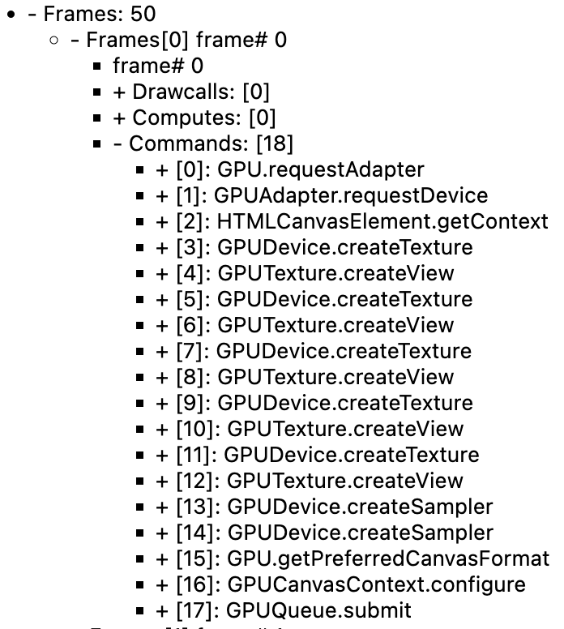

# Lesson 1 - Initialize Canvas

In this lesson you will learn the following:

- Hardware abstraction layers(HAL) based on WebGL1/2 and WebGPUs
- Canvas API design
- Implementing a simple plug-in system
- Implementing a rendering plugin based on the HAL.

When you start the project you will see an empty canvas and you can change the aspect or switch between WebGL / WebGPU renderers.

```js eval code=false
width = Inputs.range([50, 300], { label: 'width', value: 100, step: 1 });
```

```js eval code=false
height = Inputs.range([50, 300], { label: 'height', value: 100, step: 1 });
```

```js eval code=false
renderer = Inputs.select(['webgl', 'webgpu'], { label: 'renderer' });
```

```js eval code=false
(async () => {
  const { Canvas } = Lesson1;

  const $canvas = document.createElement('canvas');
  $canvas.style.outline = 'none';
  $canvas.style.padding = '0px';
  $canvas.style.margin = '0px';
  $canvas.style.border = '1px solid black';

  const canvas = await new Canvas({
    canvas: $canvas,
    renderer,
    shaderCompilerPath:
      'https://unpkg.com/@antv/g-device-api@1.6.8/dist/pkg/glsl_wgsl_compiler_bg.wasm',
  }).initialized;

  const resize = (width, height) => {
    const scale = window.devicePixelRatio;
    $canvas.width = Math.floor(width * scale);
    $canvas.height = Math.floor(height * scale);
    $canvas.style.width = `${width}px`;
    $canvas.style.height = `${height}px`;
    canvas.resize(width, height);
  };
  resize(width, height);

  const animate = () => {
    canvas.render();
    requestAnimationFrame(animate);
  };
  animate();
  return $canvas;
})();
```

## Hardware abstraction layers

I want the canvas to use more low-level rendering APIs like WebGL and WebGPU, the successor to WebGL, which has a lot of feature enhancements, see [From WebGL to WebGPU]:

- The underlying is based on a new generation of native GPU APIs, including Direct3D12 / Metal / Vulkan and more.
- Stateless API, no more unmanageable global state.
- Compute Shader support.
- There is no longer a limit to the number of contexts created per `<canvas>`.
- Developer experience improvements. Includes friendlier error messages and custom labels for GPU objects.

The WebGPU ecosystem now extends into JavaScript, C++, and Rust, and a number of web-side rendering engines (e.g. Three.js, Babylon.js) are in the process of, or have completed, accessing it. A special mention goes to [wgpu], which in addition to the game engine [bevy], has also been used in production by web-based creative design tools like [Modyfi], and has performed very well. The image below is from: [WebGPU Ecosystem]


Of course, given browser compatibility, we still need to be as compatible as possible with WebGL1/2. In the rendering engine, the Hardware Abstraction Layer (HAL) abstracts the details of the GPU hardware, allowing the upper layers to be independent of the specific hardware implementation.

We hope to provide a unified set of APIs based on WebGL1/2 and WebGPU as much as possible, along with Shader translation and modularization. The [@antv/g-device-api] implementation references [noclip] and builds on it to be compatible with WebGL1, which we also use in some of our visualization-related projects.

Since WebGL and WebGPU use different shader languages, and we don't want to maintain two sets of code, GLSL and WGSL, we choose to translate the shader at runtime:


All that is needed in the project is to maintain a set of shaders using GLSL 300 syntax, keyword replacements when downgrading to WebGL1, and conversion to GLSL 440 before handing it over to a WASM-formatted [compiler](https://github.com/antvis/g-device-api/tree /master/rust) (using naga and naga-oil) into WGSL.

The following shows the attribute declarations commonly used in the Vertex Shader. This is a very simple scenario, and the syntax actually varies a lot when it comes to the texture sampling part.

```glsl
// GLSL 300
layout(location = 0) in vec4 a_Position;

// compiled GLSL 100
attribute vec4 a_Position;

// compiled GLSL 440
layout(location = 0) in vec4 a_Position;

// compiled WGSL
var<private> a_Position_1: vec4<f32>;
@vertex
fn main(@location(0) a_Position: vec4<f32>) -> VertexOutput {
    a_Position_1 = a_Position;
}
```

Well, enough about the hardware abstraction layer, if you are interested in the implementation details you can directly refer to the [@antv/g-device-api] source code. We will use some of this API in the last subsection of this lesson.

## Design the canvas API

Finally we get to the design part of our canvas API. The simple usage we're looking forward to is as follows:

- Pass in an HTMLCanvasElement `<canvas>` to do the work of creating and initializing the canvas, including the creation of the Device (an abstract instance of the GPU) using the hardware abstraction layer.
- Create a rendering loop that keeps calling the canvas rendering methods.
- Support for resizing the canvas, e.g. in response to the `resize` event.
- Destroy itself at proper time.

```ts
const canvas = new Canvas({
  canvas: $canvas,
});

const animate = () => {
  requestAnimationFrame(animate);
  canvas.render();
};
animate();

canvas.resize(500, 500);
canvas.destroy();
```

The use of render loops is very common in rendering engines such as [Rendering the scene] in Three.js.

It looks like a very simple interface definition, but let's not rush to implement it yet, because there is an asynchronous initialization problem here.

```ts
interface Canvas {
  constructor(config: { canvas: HTMLCanvasElement });
  render(): void;
  destroy(): void;
  resize(width: number, height: number): void;
}
```

### 异步初始化

这也是 WebGPU 和 WebGL 的一大差异，在 WebGL 中获取上下文是同步的，而 WebGL 获取 Device 是一个异步过程：

```ts
// 在 WebGL 中创建上下文
const gl = $canvas.getContext('webgl');

// 在 WebGPU 中获取 Device
const adapter = await navigator.gpu.requestAdapter();
const device = await adapter.requestDevice();
```

因此在使用我们在上一节提到的硬件抽象层时，也只能使用异步方式。这一点对于所有希望从 WebGL 过渡到 WebGPU 的渲染引擎都是 Breaking Change，例如 Babylon.js [Creation of the WebGPU engine is asynchronous]：

```ts
import {
  WebGLDeviceContribution,
  WebGPUDeviceContribution,
} from '@antv/g-device-api';

// 创建一个 WebGL 的设备
const deviceContribution = new WebGLDeviceContribution({
  targets: ['webgl2', 'webgl1'],
});
// 或者创建一个基于 WebGPU 的设备
const deviceContribution = new WebGPUDeviceContribution({
  shaderCompilerPath: '/glsl_wgsl_compiler_bg.wasm',
});
// 这里是一个异步操作
const swapChain = await deviceContribution.createSwapChain($canvas);
const device = swapChain.getDevice();
// 调用 Device API 创建 GPU 对象
```

由于 JavaScript 中的构造函数不支持异步，因此为画布添加一个异步的 `init` 方法，初始化完成后再调用渲染方法：

```ts
const canvas = new Canvas();
await canvas.init();
canvas.render();
```

但我觉得这样并不好，首先 `new` 关键字已经表示了初始化含义，其次 `init` 方法似乎可以多次调用但实际上并不行。受 [Async Constructor Pattern in JavaScript] 启发，个人更倾向下面一种写法：

```ts
const canvas = await new Canvas().initialized;
```

事实上，例如 Web Animations API 的 [Animation: ready property] 也使用了这种设计模式：

```ts
animation.ready.then(() => {});
```

### 实现

在实现中我们使用一个私有变量持有 Promise，getter 也能确保它是只读的：

```ts
export class Canvas {
  #instancePromise: Promise<this>;
  get initialized() {
    return this.#instancePromise.then(() => this);
  }
}
```

在构造函数中使用立即执行的异步函数表达式（IIAFE）完成初始化工作：

```ts
constructor() {
  this.#instancePromise = (async () => {
    // 执行异步初始化
    return this;
  })();
}
```

让我们继续优化目前的设计。

## 插件系统

我们当然可以把调用硬件抽象层的代码放在 Canvas 的构造函数中，并在 `destroy` 方法中一并销毁。但后续在初始化、渲染、销毁阶段增加更多任务时，Canvas 的逻辑也会不断膨胀。我们很难在开始阶段就把所有需要支持的功能都想清楚，因此希望画布是具有可扩展性的。

```ts
destroy() {
  this.device.destroy();
  this.eventManager.destroy();
  // 省略更多需要在销毁阶段触发的任务
}
```

基于插件的架构是一种常见的设计模式，在 Webpack、VSCode 甚至是 Chrome 中都能看到它的身影。它有以下特点：

- 模块化。每个插件负责独立的部分，相互之间耦合度降低，更容易维护。
- 可扩展性。插件可以在运行时动态加载和卸载，不影响核心模块的结构，实现了应用程序的动态扩展能力。

通常该架构由以下部分组成：

- 主应用。提供插件的注册功能，在合适阶段调用插件执行，同时为插件提供运行所需的上下文。
- 插件接口。主应用和插件之间的桥梁。
- 插件集。一系列可独立执行的模块，每个插件遵循职责分离原则，仅包含所需的最小功能。

主应用如何调用插件执行呢？不妨先看看 webpack 的思路：

- 在主应用中定义一系列钩子，这些钩子可以是同步或异步，也可以是串行或并行。如果是同步串行，就和我们常见的事件监听一样了。在下面的例子中 `run` 就是一个同步串行钩子。
- 每个插件在注册时，监听自己关心的生命周期事件。下面例子中 `apply` 会在注册时调用。
- 主应用执行钩子。

```ts
class ConsoleLogOnBuildWebpackPlugin {
  apply(compiler) {
    compiler.hooks.run.tap(pluginName, (compilation) => {
      console.log('webpack 构建正在启动！');
    });
  }
}
```

webpack 实现了 [tapable] 工具库提供以上能力，为了提升大量调用场景下的性能还使用了 `new Function` 这样的手段，详见：[Is the new Function performance really good?] 的讨论。但我们只需要参考它的思路简单实现，例如同步串行执行的钩子使用了 `callbacks` 数组，没有任何黑科技：

```ts
export class SyncHook<T> {
  #callbacks: ((...args: AsArray<T>) => void)[] = [];

  tap(fn: (...args: AsArray<T>) => void) {
    this.#callbacks.push(fn);
  }

  call(...argsArr: AsArray<T>): void {
    this.#callbacks.forEach(function (callback) {
      /* eslint-disable-next-line prefer-spread */
      callback.apply(void 0, argsArr);
    });
  }
}
```

我们定义以下钩子，名称直观反映了它们会在主应用的哪个阶段被调用：

```ts
export interface Hooks {
  init: SyncHook<[]>; // 初始化阶段
  initAsync: AsyncParallelHook<[]>; // 初始化阶段
  destroy: SyncHook<[]>; // 销毁阶段
  resize: SyncHook<[number, number]>; // 宽高改变时
  beginFrame: SyncHook<[]>; // 渲染阶段
  endFrame: SyncHook<[]>; // 渲染阶段
}
```

包含这些钩子的插件上下文在插件注册阶段被传入，后续我们会继续扩展插件上下文：

```ts
export interface PluginContext {
  hooks: Hooks;
  canvas: HTMLCanvasElement;
}
export interface Plugin {
  apply: (context: PluginContext) => void;
}
```

在画布初始化时调用 `apply` 方法并传入上下文完成插件的注册，同时触发初始化同步和异步钩子，在下一节中我们实现的渲染插件会完成异步初始化：

```ts{8}
import { Renderer } from './plugins';

this.#instancePromise = (async () => {
  const { hooks } = this.#pluginContext;
  [new Renderer()].forEach((plugin) => {
    plugin.apply(this.#pluginContext);
  });
  hooks.init.call();
  await hooks.initAsync.promise();
  return this;
})();
```

现在我们拥有了所需的全部知识，可以实现第一个插件了。

## 渲染插件

我们希望支持 WebGL 和 WebGPU，因此在画布构造函数中支持通过 `renderer` 参数配置，随后传入插件上下文：

```ts{3}
constructor(config: {
  canvas: HTMLCanvasElement;
  renderer?: 'webgl' | 'webgpu';
}) {}

this.#pluginContext = {
  canvas,
  renderer,
};
```

接下来我们介绍如何在渲染插件中使用硬件抽象层。

### SwapChain

在 OpenGL / WebGL 中 [Default Framebuffer] 和通常的 Framebuffer Object(FBO) 不同，它是在初始化上下文时自动创建的。在调用绘制命令时如果没有特别指定 FBO，OpenGL 会自动将渲染结果写入 Default Framebuffer，其中的颜色缓冲区 Color Buffer 最终会显示在屏幕上。

但 Vulkan 中没有这个概念，取而代之的是 [SwapChain]，下图来自 [Canvas Context and Swap Chain] 展示了它的工作原理。GPU 向后缓冲中写入渲染结果，前缓冲用于向屏幕展示，两者可以交换。


如果不使用这种双缓冲机制，由于屏幕的刷新频率和 GPU 写入渲染结果的频率不一致，就很有可能出现前者更新时恰好后者在写入的情况，此时会造成撕裂现象。因此还需要配合垂直同步，强制展示时不允许更新，下图来自 [Canvas Context and Swap Chain] 展示了这一过程的时序图。


在 WebGPU 中使用者通常不会直接接触到 SwapChain，这部分功能被整合进了 [GPUCanvasContext] 中。同样遵循 WebGPU 设计的 [wgpu] 将 SwapChain 合并到了 [Surface] 中，使用者同样也不会直接接触到。但我们的硬件抽象层仍使用了这一概念进行封装。这样在插件初始化时，就可以根据 `renderer` 参数创建 SwapChain 和 Device：

```ts{13}
import {
  WebGLDeviceContribution,
  WebGPUDeviceContribution,
} from '@antv/g-device-api';
import type { SwapChain, DeviceContribution, Device } from '@antv/g-device-api';

export class Renderer implements Plugin {
  apply(context: PluginContext) {
    const { hooks, canvas, renderer } = context;

    hooks.initAsync.tapPromise(async () => {
      let deviceContribution: DeviceContribution;
      if (renderer === 'webgl') {
        deviceContribution = new WebGLDeviceContribution();
      } else {
        deviceContribution = new WebGPUDeviceContribution();
      }
      const { width, height } = canvas;
      const swapChain = await deviceContribution.createSwapChain(canvas);
      swapChain.configureSwapChain(width, height);

      this.#swapChain = swapChain;
      this.#device = swapChain.getDevice();
    });
  }
}
```

### devicePixelRatio

[devicePixelRatio] 描述了单个 CSS 像素应该用多少屏幕实际像素来绘制。通常我们会使用如下代码设置 `<canvas>`：

```ts
const $canvas = document.getElementById('canvas');
$canvas.style.width = `${width}px`; // CSS 像素
$canvas.style.height = `${height}px`;

const scale = window.devicePixelRatio;
$canvas.width = Math.floor(width * scale); // 屏幕实际像素
$canvas.height = Math.floor(height * scale);
```

我们在描述画布宽高、图形尺寸时使用 CSS 像素，而在创建 SwapChain 时使用屏幕实际像素。在 `resize` 时传入的宽高也使用了 CSS 像素，因此需要进行转换：

```ts{3}
hooks.resize.tap((width, height) => {
  this.#swapChain.configureSwapChain(
    width * devicePixelRatio,
    height * devicePixelRatio,
  );
});
```

那么如何获取 [devicePixelRatio] 呢？当然我们可以直接使用 `window.devicePixelRatio` 获取，绝大部分情况下都没有问题。但如果运行的环境中没有 `window` 对象呢？例如：

- Node.js 服务端渲染。例如使用 [headless-gl]
- 在 WebWorker 中渲染，使用 [OffscreenCanvas]
- 小程序等非标准浏览器环境

因此更好的做法是支持创建画布时传入，未传入时再尝试从 [globalThis] 中获取。我们对 Canvas 的构造函数参数进行如下修改：

```ts{2}
export interface CanvasConfig {
  devicePixelRatio?: number;
}

const { devicePixelRatio } = config;
const globalThis = getGlobalThis();
this.#pluginContext = {
  devicePixelRatio: devicePixelRatio ?? globalThis.devicePixelRatio,
};
```

其他钩子实现如下：

```ts
hooks.destroy.tap(() => {
  this.#device.destroy();
});

hooks.beginFrame.tap(() => {
  this.#device.beginFrame();
});

hooks.endFrame.tap(() => {
  this.#device.endFrame();
});
```

最后，将该插件添加到画布的插件列表中：

```ts{1}
[new Renderer(), ...plugins].forEach((plugin) => {
  plugin.apply(this.#pluginContext);
});
```

## 效果展示

由于还没有绘制任何图形，画布一片空白，我们如何知道底层 WebGL / WebGPU 命令的调用情况呢？在 Web 端调试可以使用 Chrome 浏览器插件：[Spector.js] 和 [webgpu-devtools]。

下图展示了使用 Spector.js 捕捉到的首帧命令，可以看到我们创建了一系列 FrameBuffer、Texture 等 GPU 对象：


切换到 WebGPU 渲染后：

```ts{3}
const canvas = await new Canvas({
  canvas: $canvas,
  renderer: 'webgpu',
}).initialized;
```

打开 WebGPU DevTools 可以看到当前我们创建的 GPU 对象和每一帧调用的命令：



## 扩展阅读

如果你完全没有 WebGL 基础，可以先尝试学习：

- [WebGL Fundamentals]
- [WebGPU Fundamentals]

更多关于插件设计模式的介绍：

- [Intro to Plugin Oriented Programming]

[WebGPU Ecosystem]: https://developer.chrome.com/blog/webgpu-ecosystem/
[From WebGL to WebGPU]: https://developer.chrome.com/blog/from-webgl-to-webgpu
[@antv/g-device-api]: https://github.com/antvis/g-device-api
[Intro to Plugin Oriented Programming]: https://pop-book.readthedocs.io/en/latest/index.html
[wgpu]: https://wgpu.rs/
[noclip]: https://github.com/magcius/noclip.website
[Modyfi]: https://digest.browsertech.com/archive/browsertech-digest-how-modyfi-is-building-with/
[Async Constructor Pattern in JavaScript]: https://qwtel.com/posts/software/async-constructor-pattern/
[Animation: ready property]: https://developer.mozilla.org/en-US/docs/Web/API/Animation/ready
[Rendering the scene]: https://threejs.org/docs/index.html#manual/en/introduction/Creating-a-scene
[Creation of the WebGPU engine is asynchronous]: https://doc.babylonjs.com/setup/support/WebGPU/webGPUBreakingChanges#creation-of-the-webgpu-engine-is-asynchronous
[Spector.js]: https://spector.babylonjs.com/
[webgpu-devtools]: https://github.com/takahirox/webgpu-devtools
[tapable]: https://github.com/webpack/tapable
[Is the new Function performance really good?]: https://github.com/webpack/tapable/issues/162
[WebGL Fundamentals]: https://webglfundamentals.org/
[WebGPU Fundamentals]: https://webgpufundamentals.org/
[devicePixelRatio]: https://developer.mozilla.org/zh-CN/docs/Web/API/Window/devicePixelRatio
[headless-gl]: https://github.com/stackgl/headless-gl
[OffscreenCanvas]: https://developer.mozilla.org/zh-CN/docs/Web/API/OffscreenCanvas
[SwapChain]: https://vulkan-tutorial.com/Drawing_a_triangle/Presentation/Swap_chain
[Default Framebuffer]: https://www.khronos.org/opengl/wiki/Default_Framebuffer
[globalThis]: https://developer.mozilla.org/en-US/docs/Web/JavaScript/Reference/Global_Objects/globalThis
[Surface]: https://docs.rs/wgpu/latest/wgpu/struct.Surface.html
[GPUCanvasContext]: https://gpuweb.github.io/gpuweb/#canvas-context
[Canvas Context and Swap Chain]: https://carmencincotti.com/2022-12-19/how-to-render-a-webgpu-triangle-series-part-three-video/#bonus-content-swap-chain
