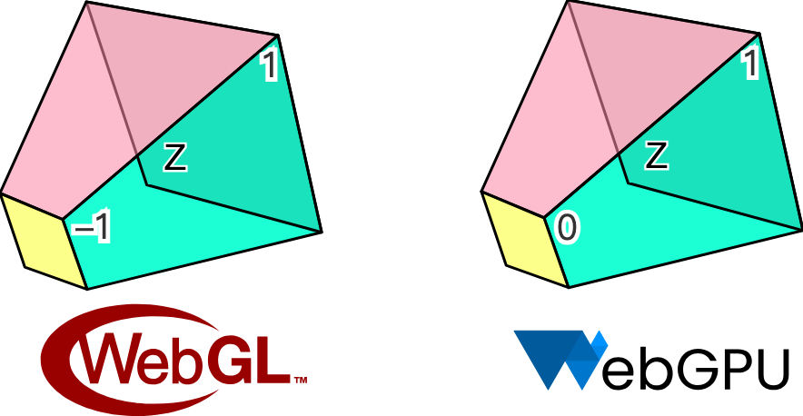

# 课程 2 - 绘制圆

在这节课中你将学习到以下内容：

- 向画布中添加图形
- 使用 SDF 绘制一个圆形
- 反走样

启动项目后将看到画布中绘制了一个圆，可以修改宽高或者切换 WebGL / WebGPU 渲染器。

```js eval code=false
width = Inputs.range([50, 300], { label: 'width', value: 100, step: 1 });
```

```js eval code=false
height = Inputs.range([50, 300], { label: 'height', value: 100, step: 1 });
```

```js eval code=false
renderer = Inputs.select(['webgl', 'webgpu'], { label: 'renderer' });
```

```js eval code=false
(async () => {
  const { Canvas, Circle } = Lesson2;

  const $canvas = document.createElement('canvas');
  $canvas.style.outline = 'none';
  $canvas.style.padding = '0px';
  $canvas.style.margin = '0px';
  $canvas.style.border = '1px solid black';

  const canvas = await new Canvas({
    canvas: $canvas,
    renderer,
    shaderCompilerPath:
      'https://unpkg.com/@antv/g-device-api@1.6.8/dist/pkg/glsl_wgsl_compiler_bg.wasm',
  }).initialized;

  const circle = new Circle({
    cx: 100,
    cy: 100,
    r: 50,
    fill: 'red',
  });
  canvas.appendChild(circle);

  const resize = (width, height) => {
    $canvas.width = width * window.devicePixelRatio;
    $canvas.height = height * window.devicePixelRatio;
    $canvas.style.width = `${width}px`;
    $canvas.style.height = `${height}px`;
    canvas.resize(width, height);
  };
  resize(width, height);

  const animate = () => {
    canvas.render();
    requestAnimationFrame(animate);
  };
  animate();
  return $canvas;
})();
```

## 向画布中添加图形

上一课我们创建了一个空白画布，后续我们会向其中添加各种图形，如何设计这样的 API 呢？作为前端开发者，不妨借鉴熟悉的 [Node API appendChild]：

```ts
canvas.appendChild(shape);
canvas.removeChild(shape);
```

暂时创建一个图形基类，后续 Circle、Ellipse、Rect 等图形都会继承它：

```ts
export abstract class Shape {}
```

在画布中使用数组存储图形列表：

```ts
#shapes: Shape[] = [];

appendChild(shape: Shape) {
  this.#shapes.push(shape);
}

removeChild(shape: Shape) {
  const index = this.#shapes.indexOf(shape);
  if (index !== -1) {
    this.#shapes.splice(index, 1);
  }
}
```

在画布渲染方法中遍历图形列表，调用渲染钩子：

```ts{4}
render() {
  const { hooks } = this.#pluginContext;
  hooks.beginFrame.call();
  this.#shapes.forEach((shape) => {
    hooks.render.call(shape);
  });
  hooks.endFrame.call();
}
```

在渲染插件中每一帧开始前都会创建一个 `RenderPass`，硬件抽象层在这里进行了封装。WebGL 中并没有这个概念，WebGPU 中 [beginRenderPass] 会返回 [GPURenderPassEncoder]，通过它可以记录包括 `draw` 在内的一系列命令，后续在 `render` 钩子中我们会看到。在创建 `RenderPass` 时我们提供了以下参数：

- `colorAttachment`
- `colorResolveTo` 输出到屏幕
- `colorClearColor` WebGL 中通过 [gl.clearColor] 命令实现；WebGPU 中以 [clearValue] 属性声明，这里我们设置为白色。

```ts{4}
hooks.beginFrame.tap(() => {
  this.#device.beginFrame();

  this.#renderPass = this.#device.createRenderPass({
    colorAttachment: [renderTarget],
    colorResolveTo: [onscreenTexture],
    colorClearColor: [TransparentWhite],
  });
});
```

与创建对应，在每一帧结束后提交 `RenderPass`，同样在 WebGPU 中很容易找到对应的 [submit] 方法，当然原生 API 提交的是一个编码后的命令缓冲，硬件抽象层简化了这些概念。

```ts{2}
hooks.endFrame.tap(() => {
  this.#device.submitPass(this.#renderPass);
  this.#device.endFrame();
});
```

最后来到 `render` 钩子，每个图形负责实现绘制自身的逻辑，插件负责传入所需的 GPU 对象例如 Device 和 `RenderPass`。

```ts
hooks.render.tap((shape) => {
  // 稍后实现绘制逻辑
});
```

## 绘制圆形 ⭕️

首先我们需要定义圆形的基础属性，熟悉 SVG [circle] 的开发者一定知道，基于圆心 `cx/cy` 和半径 `r` 可以定义圆的几何形状，配合填充色 `fill`、描边色 `stroke` 这些通用绘图属性就能满足基础需求了。

```ts
export class Circle extends Shape {
  constructor(
    config: Partial<{
      cx: number;
      cy: number;
      r: number;
      fill: string;
    }> = {},
  ) {}
}
```

### 画布坐标系

既然提到 `cx/cy` 圆心这样的位置属性，就必须要明确我们使用的画布坐标系。在 Canvas 和 SVG 中，坐标系原点都是左上角，X 轴正向 👉，Y 轴正向 👇。但 WebGL 中使用的 [裁剪坐标系] 遵循 OpenGL 规范，原点在视口中心，X 轴正向 👉，Y 轴正向 👆，Z 轴正向向屏幕内。下面这个长宽高各为 2 的立方体也称作 normalized device coordinates (NDC)：


但 WebGPU 遵循 Metal 规范，和 WebGL 有些差别，Y 轴正向 👇，Z 轴正向向外。另外在 Z 轴的裁剪范围上也有不同，WebGL 下为 `[-1, 1]`，而 WebGPU 为 `[0, 1]`：



我们的硬件抽象层会尝试抹平 WebGL 和 WebGPU 的差异，但在坐标系上选择和 Canvas / SVG 保持一致，我们相信这更符合画板使用者的习惯。


因此如果我们的画布宽高均为 200，用如下方式添加的 `Circle` 将会出现在画布中心：

```ts
const circle = new Circle({
  cx: 100,
  cy: 100,
  r: 50,
  fill: 'red',
});
canvas.appendChild(circle);
```

下面的问题是如何将屏幕坐标系中的 `cx/cy` 转换成 NDC 交给渲染管线。后续我们会将画布的宽高以 Uniform 形式传入，圆的位置以 Attribute 传入，位置除以宽高将得到一个 `[0, 1]` 范围的值，乘以二再减一就可以转换成 `[-1, 1]` 即 NDC 下的范围值。最后翻转下 Y 轴：

```glsl
layout(std140) uniform SceneUniforms {
  vec2 u_Resolution; // 画布宽高
};
layout(location = 1) in vec2 a_Position; // 圆心

// Pixel space to [0, 1] (Screen space)
vec2 zeroToOne = (a_Position.x + a_Size * a_FragCoord) / u_Resolution;

// Convert from [0, 1] to [0, 2]
vec2 zeroToTwo = zeroToOne * 2.0;

// Convert from [0, 2] to [-1, 1] (NDC/clip space)
vec2 clipSpace = zeroToTwo - 1.0;

// Flip Y axis
gl_Position = vec4(clipSpace * vec2(1, -1), 0.0, 1.0);
```

### 处理颜色值

不同于 Canvas 或者 SVG，字符串形式的颜色值是无法直接在 WebGL 或者 WebGPU 中使用的，好在 [d3-color] 可以帮助我们转换成 `{ r, g, b, opacity }` 格式，后续可以直接以 `vec4` 或压缩形式传入 `attribute` 中。最后，我们暂时只支持 RGB 空间的颜色值，这意味着 [hsl] 等形式暂不可用：

```ts
import * as d3 from 'd3-color';

set fill(fill: string) {
  this.#fill = fill;
  this.#fillRGB = d3.rgb(fill); // { r, g, b, opacity }
}
```

解决了样式问题，让我们回到几何部分。在三维渲染中三角网格（Triangle Mesh）是常用的几何表达，Three.js 中的 [CircleGeometry] 正是通过程序化生成几何的方式，将圆形从圆心出发分割成多个三角形。显然三角形越多圆就越平滑，如果只有两个三角形就退化成了正方形。为了得到一个平滑的圆，就需要较多的顶点，当圆的数目上升时会造成 GPU 内存显著增长。


### SDF

使用一种名为 Signed Distance Functions（SDF）的方法只需要四个顶点。下图直观地展示了 SDF 的概念，来自新兴编辑器 Zed 的实践文章 [drawing-rectangles]。平面上的点之于一个半径为 100 的圆，在圆上距离为 0，在圆内和圆外分别为负值和正值：


> 原文中使用 Lottie 动画展示了有向距离场的定义和一些基础图形的公式推导过程。在 Zed 的 GPUI 中也使用 SDF 绘制基础图形以获取更好的性能。

通常我们在 Vertex Shader 中构建坐标系，假设

```glsl
layout(location = 0) in vec2 a_FragCoord;
out vec2 v_FragCoord;
void main() {
  v_FragCoord = a_FragCoord;
}
```

有了距离信息就可以在 Fragment Shader 中依据不同图形的 SDF 公式，将当前像素点坐标带入就可以判断点是否在图形内部，如果在外部就可以直接丢弃，否则进行着色，GLSL 代码如下：

```glsl
float sdf_circle(vec2 p, float r) {
  return length(p) - r;
}

void main() {
  float distance = sdf_circle(v_FragCoord, 1.0);
  if (distance > 0.0) { // 在圆外，直接丢弃
    discard;
  }
  outputColor = vec4(1.0, 0.0, 0.0, 1.0); // 着色
}
```

除了更少的顶点使用，SDF 还具有以下优点：

- 易于抗锯齿/反走样。我们在下一小节会介绍它。
- 易于组合。交集、差集运算可以通过组合完成复杂图形的绘制。
- 易于实现一些看起来很复杂的效果。例如描边、圆角、阴影，当然我们后续在实现这些效果时也会介绍该方法的一些局限性。

对于 SDF 的解释和详细推导过程也可以在 [distfunctions] 中找到，这种方法可以绘制各种常见的 2D 甚至是 3D 图形，后续我们也会继续使用该方法绘制矩形和文本。

让我们回到图形基类，我们增加一个方法接收所需参数进行绘制：

```ts{2}
export abstract class Shape {
  abstract render(device: Device, renderPass: RenderPass): void;
}
```

在插件的 `render` 钩子中调用并传入所需参数：

```ts
hooks.render.tap((shape) => {
  shape.render(this.#device, this.#renderPass);
});
```

在 `Circle` 的 `render` 方法中构建一个单位坐标系，和 clip space 一致，包含四个顶点，通过 `indexBuffer` 索引数组分割成两个三角形（V0 -> V1 -> V2 和 V0 -> V2 -> V3）：


```ts
this.#fragUnitBuffer = device.createBuffer({
  viewOrSize: new Float32Array([-1, -1, 1, -1, 1, 1, -1, 1]),
  usage: BufferUsage.VERTEX,
});

this.#indexBuffer = device.createBuffer({
  viewOrSize: new Uint32Array([0, 1, 2, 0, 2, 3]),
  usage: BufferUsage.INDEX,
});
```

在这四个顶点中，每个顶点可以共享同样的样式属性，例如圆心、半径、填充色等。这样可以减少顶点数组内存的大小：

```ts
this.#instancedBuffer = device.createBuffer({
  viewOrSize: new Float32Array([
    this.#cx,
    this.#cy,
    this.#r,
    this.#r,
    this.#fillRGB.r,
    this.#fillRGB.g,
    this.#fillRGB.b,
    this.#fillRGB.opacity,
  ]),
  usage: BufferUsage.VERTEX,
});
```

接着指定顶点数组的排布方式，通过 `shaderLocation` 和 Shader 关联

```ts
this.#inputLayout = device.createInputLayout({
  vertexBufferDescriptors: [
    {
      arrayStride: 4 * 2,
      stepMode: VertexStepMode.VERTEX,
      attributes: [
        {
          shaderLocation: 0, // layout(location = 0) in vec2 a_FragCoord;
          offset: 0,
          format: Format.F32_RG,
        },
      ],
    },
    {
      arrayStride: 4 * 8,
      stepMode: VertexStepMode.INSTANCE,
      attributes: [
        {
          shaderLocation: 1, // layout(location = 1) in vec2 a_Position;
          offset: 0,
          format: Format.F32_RG,
        },
        {
          shaderLocation: 2, // layout(location = 2) in vec2 a_Size;
          offset: 4 * 2,
          format: Format.F32_RG,
        },
        {
          shaderLocation: 3, // layout(location = 3) in vec4 a_FillColor;
          offset: 4 * 4,
          format: Format.F32_RGBA,
        },
      ],
    },
  ],
  indexBufferFormat: Format.U32_R,
  program: this.#program,
});
```

## 反走样

仔细观察或者放大可以看到边缘明显的锯齿，毕竟在 Fragment Shader 中我们对于每个像素点使用了粗暴的判定方式：要么着色要么丢弃，完全没有过渡的中间地带。


在 [Using fwidth for distance based anti-aliasing] 一文中介绍了使用 `fwidth` 对 SDF 进行反走样的方法。[What is fwidth and how does it work?] 这个回答详细介绍了该方法的概念和计算方式。简而言之现代 GPU 以 2x2 的像素块为基本单位，便于开发者获取该像素点针对某个值的变化剧烈程度，OpenGL / WebGL 和 WebGPU 都提供了以下方法：

- `dFdx` 计算屏幕水平方向上，一像素跨度内参数属性值改变了多少
- `dFdy` 计算屏幕垂直方向上，一像素跨度内参数属性值改变了多少
- `fwidth` 计算 `abs(dFdx) + abs(dFdy)`

我们把 SDF 计算得到的距离传入，计算得到它的变化程度最终反映在透明度上。这里需要通过 `smoothstep` 进行平滑处理。[Smoothstep - thebookofshaders.com] 形如：


```glsl
float aaf = fwidth(distance);
float alpha = smoothstep(0.0, -aaf, distance);

outputColor.a *= alpha;
```

这样反走样效果就完成了：


## 扩展阅读

- [distfunctions]
- [Leveraging Rust and the GPU to render user interfaces at 120 FPS]

[Node API appendChild]: https://developer.mozilla.org/en-US/docs/Web/API/Node/appendChild
[GPURenderPassEncoder]: https://developer.mozilla.org/en-US/docs/Web/API/GPURenderPassEncoder
[beginRenderPass]: https://developer.mozilla.org/en-US/docs/Web/API/GPUCommandEncoder/beginRenderPass
[submit]: https://developer.mozilla.org/en-US/docs/Web/API/GPUQueue/submit
[circle]: https://developer.mozilla.org/en-US/docs/Web/SVG/Element/circle
[d3-color]: https://github.com/d3/d3-color
[hsl]: https://developer.mozilla.org/en-US/docs/Web/CSS/color_value/hsl
[CircleGeometry]: https://threejs.org/docs/#api/en/geometries/CircleGeometry
[drawing-rectangles]: https://zed.dev/blog/videogame#drawing-rectangles
[distfunctions]: https://iquilezles.org/articles/distfunctions/
[Leveraging Rust and the GPU to render user interfaces at 120 FPS]: https://zed.dev/blog/videogame
[gl.clearColor]: https://developer.mozilla.org/en-US/docs/Web/API/WebGLRenderingContext/clearColor
[clearValue]: https://www.w3.org/TR/webgpu/#dom-gpurenderpasscolorattachment-clearvalue
[Using fwidth for distance based anti-aliasing]: http://www.numb3r23.net/2015/08/17/using-fwidth-for-distance-based-anti-aliasing/
[What is fwidth and how does it work?]: https://computergraphics.stackexchange.com/a/63
[Smoothstep - thebookofshaders.com]: https://thebookofshaders.com/glossary/?search=smoothstep
