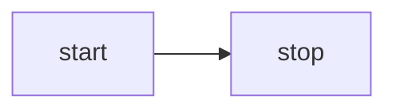

<script setup>
import Mermaid from '../components/Mermaid.vue'
import MermaidRough from '../components/MermaidRough.vue'
</script>

# Lesson 32 - Text to diagram

In the previous session, we enabled the expression of connections between graphics, meaning we can now render many types of diagrams. Large models offer excellent support for numerous text-based diagramming languages, such as [mermaid], [D2], and [draw.io].

## Mermaid {#mermaid}

Excalidraw provides the [mermaid-to-excalidraw/api]. If you're interested in its internal implementation, you can read the official documentation: [How the Parser works under the hood ?]


In summary, Excalidraw supports only a limited subset of Mermaid diagram types. It parses the SVG output from the Mermaid renderer, converts it into an internal scene diagram representation, and uses the Diagram JSON obtained from the parser to retrieve relationships between nodes.

Take the simplest Mermaid flowchart below as an example:



First, Mermaid's deprecated API is used to parse the text, extracting chart types, nodes, and edge relationships, but without geometric information:

```ts
import mermaid, { MermaidConfig } from 'mermaid';
const diagram = await mermaid.mermaidAPI.getDiagramFromText(definition); // "flowchart LR..."
```

Then use Mermaid's rendering method to render the SVG into a hidden container on the page. This also reveals the limitations of this approach: it can only be executed in a browser environment. Extract the node and edge geometric information from the rendered SVG output, using the node and edge IDs obtained in the previous step:

```ts
const { svg } = await mermaid.render('mermaid-to-excalidraw', definition);
```

Finally, convert it into a scene graph accepted by our canvas, with text on nodes creating separate child nodes:

```ts
function convertFlowchartToSerializedNodes(
    vertices: Map<string, Vertex>,
    edges: Edge[],
    options: { fontSize: number },
): SerializedNode[] {
    vertices.forEach((vertex) => {
        // Vertex
        const serializedNode: SerializedNode = {
            id: vertex.id,
            type: 'rect',
            x: vertex.x,
            y: vertex.y,
            width: vertex.width,
            height: vertex.height,
            stroke: 'black',
            strokeWidth: 2,
        };
        // Label of vertex
        const textSerializedNode: TextSerializedNode = {
            parentId: vertex.id,
            content: getText(vertex),
            //...
        };
    });
    // Edges
}
```

<Mermaid />

Simply replacing the type of graphics can achieve hand-drawn style rendering:

```ts
nodes.forEach((node) => {
    if (node.type === 'rect') {
        node.type = 'rough-rect';
    } else if (node.type === 'line') {
        node.type = 'rough-line';
    } else if (node.type === 'text') {
        node.fontFamily = 'Gaegu';
    }
});
```

<MermaidRough />

## Extended reading {#extended-reading}

-   [Discussion in HN]

[mermaid]: https://mermaid.js.org
[mermaid-to-excalidraw/api]: https://docs.excalidraw.com/docs/@excalidraw/mermaid-to-excalidraw/api
[How the Parser works under the hood ?]: https://docs.excalidraw.com/docs/@excalidraw/mermaid-to-excalidraw/codebase/parser
[D2]: https://github.com/terrastruct/d2
[draw.io]: https://app.diagrams.net/
[Discussion in HN]: https://news.ycombinator.com/item?id=44954524
