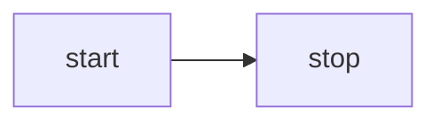

<script setup>
import Mermaid from '../../components/Mermaid.vue'
import MermaidRough from '../../components/MermaidRough.vue'
import D2 from '../../components/D2.vue'
</script>

# 课程 32 - 文本生成图表

在上节课中我们支持了图形间的连接关系表达，这意味着很多类型的图表我们都可以渲染了。大模型对于很多基于文本语法的图表支持度非常好，例如 [mermaid]、[D2] 和 [draw.io]

## Mermaid {#mermaid}

excalidraw 提供了 [mermaid-to-excalidraw/api]，如果对内部实现感兴趣可以阅读官方的文章：[How the Parser works under the hood ?]


总之 excalidraw 仅支持少部分的 mermaid 图表类型，解析 mermaid 渲染器的 SVG 结果转换成内部场景图表达，并利用解析器得到的 Diagram JSON 获取节点间的关系。

以下面最简单的 Mermaid 流程图为例：



首先使用 Mermaid 被废弃的 API 解析文本，得到图表类型、节点和边的逻辑关系信息，但并不包含几何信息：

```ts
import mermaid, { MermaidConfig } from 'mermaid';
const diagram = await mermaid.mermaidAPI.getDiagramFromText(definition); // "flowchart LR..."
```

然后使用 Mermaid 的渲染方法将 SVG 渲染到页面的一个隐藏容器中，这也能看到该方法的局限性：只能在浏览器环境执行。从 SVG 的渲染结果中获取节点和边的几何信息，使用上一步中获得的节点和边 ID：

```ts
const { svg } = await mermaid.render('mermaid-to-excalidraw', definition);
```

最后转换成我们的画布接受的场景图，节点上的文本创建单独的子节点：

```ts
function convertFlowchartToSerializedNodes(
    vertices: Map<string, Vertex>,
    edges: Edge[],
    options: { fontSize: number },
): SerializedNode[] {
    vertices.forEach((vertex) => {
        // Vertex
        const serializedNode: SerializedNode = {
            id: vertex.id,
            type: 'rect',
            x: vertex.x,
            y: vertex.y,
            width: vertex.width,
            height: vertex.height,
            stroke: 'black',
            strokeWidth: 2,
        };
        // Label of vertex
        const textSerializedNode: TextSerializedNode = {
            parentId: vertex.id,
            content: getText(vertex),
            //...
        };
    });
    // Edges
}
```

<Mermaid />

简单地替换图形的类型，就可以实现手绘风格的渲染：

```ts
nodes.forEach((node) => {
    if (node.type === 'rect') {
        node.type = 'rough-rect';
    } else if (node.type === 'line') {
        node.type = 'rough-line';
    } else if (node.type === 'text') {
        node.fontFamily = 'Gaegu';
    }
});
```

<MermaidRough />

## D2 {#d2}

相比 Mermaid，D2 提供了很方便的解析器。

```ts
import { D2 } from '@terrastruct/d2';

const d2 = new D2();
const { diagram, graph } = await d2.compile(definition);
const { connections, shapes } = diagram;
const {
    theme: { colors },
} = graph;
```

```d2
x -> y: hello world
```

<D2 />

## 扩展阅读 {#extended-reading}

-   [Discussion in HN]

[mermaid]: https://mermaid.js.org
[mermaid-to-excalidraw/api]: https://docs.excalidraw.com/docs/@excalidraw/mermaid-to-excalidraw/api
[How the Parser works under the hood ?]: https://docs.excalidraw.com/docs/@excalidraw/mermaid-to-excalidraw/codebase/parser
[D2]: https://github.com/terrastruct/d2
[draw.io]: https://app.diagrams.net/
[Discussion in HN]: https://news.ycombinator.com/item?id=44954524
