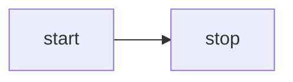

<script setup>
import Mermaid from '../../components/Mermaid.vue'
import MermaidRough from '../../components/MermaidRough.vue'
import MermaidFlowchart from '../../components/MermaidFlowchart.vue'
import D2 from '../../components/D2.vue'
import Drawio from '../../components/Drawio.vue'
</script>

# 课程 32 - 文本生成图表

在上节课中我们支持了图形间的连接关系表达，这意味着很多类型的图表我们都可以渲染了。大模型对于很多基于文本语法的图表支持度非常好，例如 [mermaid]、[D2] 和 [draw.io]

## Mermaid {#mermaid}

excalidraw 提供了 [mermaid-to-excalidraw/api]，如果对内部实现感兴趣可以阅读官方的文章：[How the Parser works under the hood ?]


总之 excalidraw 仅支持少部分的 mermaid 图表类型，解析 mermaid 渲染器的 SVG 结果转换成内部场景图表达，并利用解析器得到的 Diagram JSON 获取节点间的关系。

### 流程图 {#flowchart}

以下面最简单的 Mermaid 流程图为例：


```mermaid
flowchart LR
 start-->stop
```

首先使用 Mermaid 被废弃的 API 解析文本，得到图表类型、节点和边的逻辑关系信息，但并不包含几何信息：

```ts
import mermaid, { MermaidConfig } from 'mermaid';
const diagram = await mermaid.mermaidAPI.getDiagramFromText(definition); // "flowchart LR..."
```

然后使用 Mermaid 的渲染方法将 SVG 渲染到页面的一个隐藏容器中，这也能看到该方法的局限性：只能在浏览器环境执行。从 SVG 的渲染结果中获取节点和边的几何信息，使用上一步中获得的节点和边 ID：

```ts
const { svg } = await mermaid.render('mermaid-to-excalidraw', definition);
```

最后转换成我们的画布接受的场景图，节点上的文本创建单独的子节点：

```ts
function convertFlowchartToSerializedNodes(
    vertices: Map<string, Vertex>,
    edges: Edge[],
    options: { fontSize: number },
): SerializedNode[] {
    vertices.forEach((vertex) => {
        // Vertex
        const serializedNode: SerializedNode = {
            id: vertex.id,
            type: 'rect',
            x: vertex.x,
            y: vertex.y,
            width: vertex.width,
            height: vertex.height,
            stroke: 'black',
            strokeWidth: 2,
        };
        // Label of vertex
        const textSerializedNode: TextSerializedNode = {
            parentId: vertex.id,
            content: getText(vertex),
            //...
        };
    });
    // Edges
}
```

<Mermaid />

简单地替换图形的类型，就可以实现手绘风格的渲染：

```ts
nodes.forEach((node) => {
    if (node.type === 'rect') {
        node.type = 'rough-rect';
    } else if (node.type === 'line') {
        node.type = 'rough-line';
    } else if (node.type === 'text') {
        node.fontFamily = 'Gaegu';
    }
});
```

<MermaidRough />

## D2 {#d2}

相比 Mermaid，D2 提供了很方便的解析器。

```ts
import { D2 } from '@terrastruct/d2';

const d2 = new D2();
const { diagram, graph } = await d2.compile(definition);
const { connections, shapes } = diagram;
const {
    theme: { colors },
} = graph;
```

```d2
x -> y: hello world
```

<D2 />

## drawio {#drawio}

我找到了一个社区的解析器：

```ts
import { parseDrawIO } from 'mxgraphdata';
const mxfile = await parseDrawIO(xml);
console.log(mxfile.diagram);
```

<Drawio />

## 边上的标签 {#label-on-edge}

边上的文本标签需要始终放置在几何中心，在下一节 [课程 33 - 布局引擎] 中我们会介绍通用的实现方式。但具体到这个问题，我们不妨先分析一下 excalidraw、tldraw 和 drawio 中的实现。

### 独立节点还是属性 {#node-or-attribute}

在 Excalidraw 中，「edge（线/箭头）」上放置文本 label，核心不是“让 text 跟着 path 走、沿曲线排版”，而是更简单可靠的做法：

1. label 仍然是一个独立的 text element（不是线的一部分渲染文本）
2. 在数据上把 text 绑定到线（arrow/line）：text 记录它“属于哪条线”，线也会记录“它的 label text id”或等价关系
3. 用几何计算给 text 一个锚点（anchor point）：通常取线的“中点”或某个 labelPosition（0~1 的参数），再根据线的形状（直线/折线/曲线）求出对应点
4. 把 text 当成附着物（bound element）处理：当线移动、线端点拖动、折点变化、箭头翻转时，都会重新算 label 的位置，并更新 text 的坐标（同时处理避免与线重叠、偏移量、对齐方式）

tldraw 的做法则不同，label 不是单独的 text shape，而是 arrow shape 自己的一个 props（richText）+ 一套几何定位与编辑交互。

draw.io 里在 edge（连线）上放置文本 label，属于它的核心能力之一，实现方式更接近传统流程图编辑器：“Edge 有自己的 label（文本）能力，label 作为 edge 的子状态存在，并且位置用几何参数/偏移存储”，而不是单独创建一个文本节点再去绑定。

### 我们的实现 {#our-implementation}

采用 Excalidraw 式模型：边上的文案仍是独立的 text 节点，用 parentId 挂在该 polyline 上，并用 edgeLabelPosition（0–1，沿折线弧长） 表示“贴在边的哪一段上”。

```ts
export interface TextSerializedNode
  extends BaseSerializeNode<'text'>,
  Partial<TextAttributes>,
  Partial<{
    /**
     * When set, this text is an edge label: parent should be a bound polyline/line.
     * Value is 0–1 along total edge length (arc-length parameter).
     */
    edgeLabelPosition: number;
  }>;
```

<MermaidFlowchart />

### 提升可读性 {#improve-readability}

边上的标签需要可读性优化处理，尤其是避免与边线重合导致文字难以辨认。

#### 背景色 {#label-background}

可以为标签添加不透明的背景色，遮挡住下方的边线。

-   mxGraph (draw.io)：通过 labelBackgroundColor 样式属性实现。例如 labelBackgroundColor=white 会为标签添加白色背景框。此外还有 labelBorderColor 可添加边框。
-   tldraw：虽然不直接为箭头标签提供背景色选项，但其文本形状支持 showTextOutline 配置，可显示文本轮廓以提高对比度。
-   Excalidraw：作为独立文本元素，可通过 backgroundColor 属性设置背景色，系统会自动在文字背后绘制填充矩形。

#### 间距与内边距 {#padding-inset}

还可以通过垂直于边方向的偏移量和内部间距，确保文字与边线保持物理距离：

#### 自动避让算法 {#conflict-avoidance}

Excalidraw 和 tldraw 作为手绘风格工具，不支持复杂的自动避让算法，它们依赖用户手动拖动调整。而 mxGraph (draw.io) 作为专业图表工具，提供了更精细的防重叠控制。

#### 文本轮廓 {#text-outline}

作为背景色的轻量级替代方案，在文字周围添加描边或阴影，增强与背景的对比度：

-   tldraw：showTextOutline 选项（默认开启，Safari 除外）在文字后绘制细轮廓，即使重叠也能保持可读性。
-   通用技术：CSS 的 text-shadow 或 Canvas 的 strokeText 都可实现类似效果，常用于地图标注领域。

## 扩展阅读 {#extended-reading}

-   [Discussion in HN]

[mermaid]: https://mermaid.js.org
[mermaid-to-excalidraw/api]: https://docs.excalidraw.com/docs/@excalidraw/mermaid-to-excalidraw/api
[How the Parser works under the hood ?]: https://docs.excalidraw.com/docs/@excalidraw/mermaid-to-excalidraw/codebase/parser
[D2]: https://github.com/terrastruct/d2
[draw.io]: https://app.diagrams.net/
[Discussion in HN]: https://news.ycombinator.com/item?id=44954524
[课程 33 - 布局引擎]: /zh/guide/lesson-033
